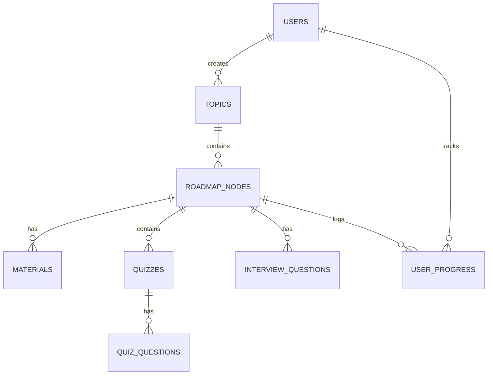

# Database Schema: NeuraFlow AI

NeuraFlow AI uses a relational database design managed by SQLAlchemy. Below is the entity-relationship model and table specifications.

---

## 1. Table Specifications

### `users`
Stores user profile information and credentials.
- `id` (UUID or Integer, Primary Key)
- `name` (VARCHAR(100), Not Null)
- `email` (VARCHAR(120), Unique, Indexed, Not Null)
- `password_hash` (VARCHAR(255), Not Null)
- `created_at` (TIMESTAMP, Default: current time)

### `topics`
Represents a user-initiated study subject (e.g. "Machine Learning").
- `id` (Integer, Primary Key, Auto-increment)
- `user_id` (Integer, Foreign Key to `users.id`, Cascade Delete)
- `title` (VARCHAR(255), Not Null)
- `status` (VARCHAR(50), Default: 'generating' - enum: 'generating', 'completed', 'failed')
- `created_at` (TIMESTAMP, Default: current time)

### `roadmap_nodes`
Individual sections/chapters of the learning roadmap generated for a topic.
- `id` (Integer, Primary Key, Auto-increment)
- `topic_id` (Integer, Foreign Key to `topics.id`, Cascade Delete)
- `title` (VARCHAR(255), Not Null)
- `description` (TEXT, Nullable)
- `order` (Integer, Not Null) - Determines sequence.
- `created_at` (TIMESTAMP, Default: current time)

### `materials`
Study guides generated for each roadmap node.
- `id` (Integer, Primary Key, Auto-increment)
- `node_id` (Integer, Foreign Key to `roadmap_nodes.id`, Cascade Delete)
- `beginner_notes` (TEXT, Not Null)
- `detailed_notes` (TEXT, Not Null)
- `revision_notes` (TEXT, Not Null)
- `created_at` (TIMESTAMP, Default: current time)

### `quizzes`
Quizzes generated for each roadmap node.
- `id` (Integer, Primary Key, Auto-increment)
- `node_id` (Integer, Foreign Key to `roadmap_nodes.id`, Cascade Delete)
- `title` (VARCHAR(255), Not Null)
- `created_at` (TIMESTAMP, Default: current time)

### `quiz_questions`
Multiple-choice questions that make up a quiz.
- `id` (Integer, Primary Key, Auto-increment)
- `quiz_id` (Integer, Foreign Key to `quizzes.id`, Cascade Delete)
- `question_text` (TEXT, Not Null)
- `options` (JSON / TEXT, Not Null) - List of 4 answers, serialized as JSON string.
- `correct_answer` (VARCHAR(255), Not Null) - Must match one option.
- `explanation` (TEXT, Nullable) - Clarification of the correct answer.

### `interview_questions`
Interview-style questions and answers mapped to a roadmap node.
- `id` (Integer, Primary Key, Auto-increment)
- `node_id` (Integer, Foreign Key to `roadmap_nodes.id`, Cascade Delete)
- `question` (TEXT, Not Null)
- `answer` (TEXT, Not Null)
- `created_at` (TIMESTAMP, Default: current time)

### `user_progress`
Logs completion status and quiz performance for users on specific nodes.
- `id` (Integer, Primary Key, Auto-increment)
- `user_id` (Integer, Foreign Key to `users.id`, Cascade Delete)
- `node_id` (Integer, Foreign Key to `roadmap_nodes.id`, Cascade Delete)
- `is_completed` (BOOLEAN, Default: False)
- `quiz_score` (Integer, Nullable) - Highest score achieved on the node's quiz.
- `completed_at` (TIMESTAMP, Nullable)
- `updated_at` (TIMESTAMP, Default: current time)

---

## 2. Integrity Constraints & Relationships
- **Cascading Deletes**: If a `topic` is deleted, all related `roadmap_nodes`, `materials`, `quizzes`, `quiz_questions`, and `interview_questions` must automatically be deleted.
- **Foreign Key Constraints**: All references to users, topics, and nodes are strictly validated via SQL constraints.
- **Indexes**: Indices are placed on `users.email` and foreign key fields to speed up typical join queries.
